# UNSUPERVISED PERSON LOCALIZATION IN WISAR

# Introduction

This is part of the exercise class "UE Computer Vision, Oliver Bimber / Indrajit Kurmi, 2021W" at the JKU Austria.
The responsible instituate at JKU is https://www.jku.at/en/institute-of-computer-graphics/ 
Whereas this a specific research project for them https://www.jku.at/en/institute-of-computer-graphics/research/projects/2021 

In this lab project we had to implement an unsupervised person localization algorithm.

## Challenge 

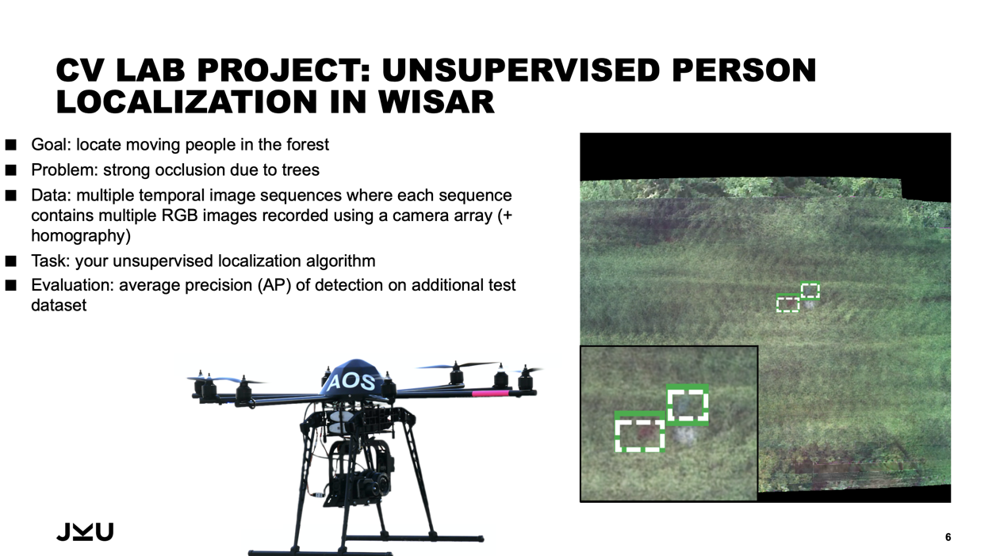

### Data extraction

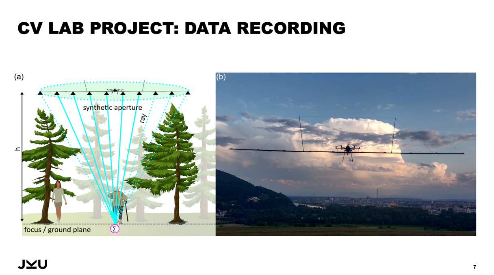

## Methods and solution

### 0. Image pre-processing

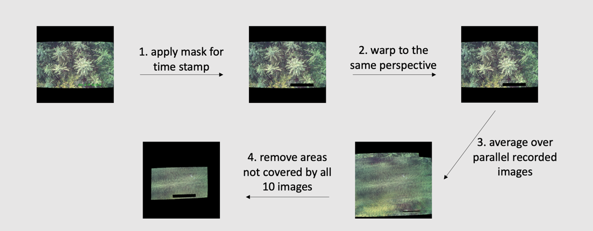

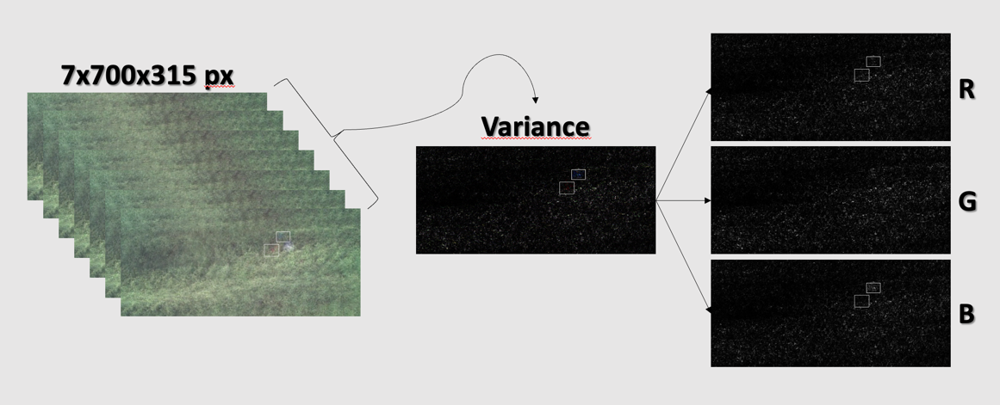

### 1. Color channels approach

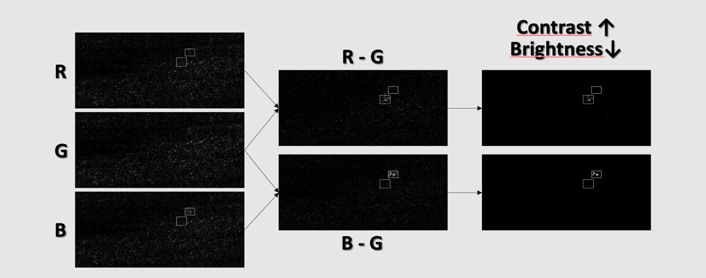

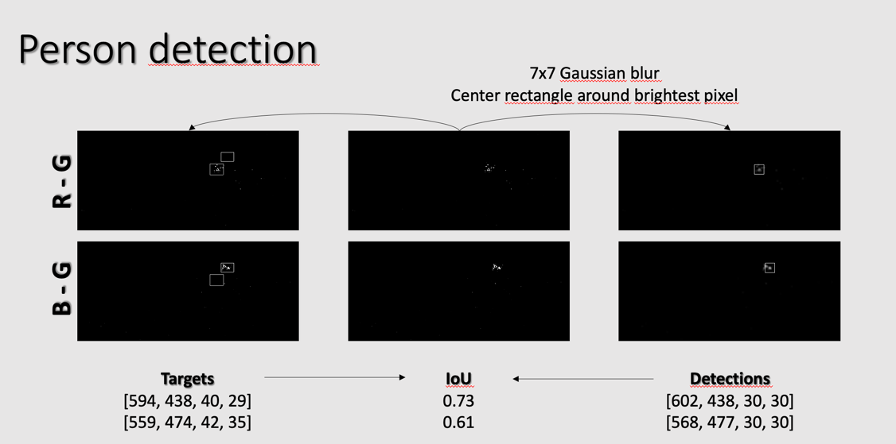

- Advantage: 
  - can distinguish people from other objects by detecting movement
- Disadvantages:
  - fixed size of labels  to be improved
  - bias towards detecting people wearing blue or red – problems finding people with green clothing
  - cannot detect people that are not moving or moving too little

### 2. Autoencoder approach

#### Initial idea

Going through various research papers on anomaly detection, we decided to try out an Autoencoder approach for this task

- Autoencoder -> encoder-decoder system to reconstruct the input as the output. 
- Train a convolutional autoencoder so that it will reconstruct an image from the normal data with a smaller reconstruction error, but reconstruct an image from the anomaly data with a larger reconstruction error 
- Our solution decides if an image is from the normal data or from the anomaly data based on a threshold of the reconstruction error.

- the model is encouraged to learn to precisely reproduce the most frequently observed characteristics
- when facing anomalies, the model should worsen its reconstruction performance. 
- after training, the autoencoder will accurately reconstruct normal data, while failing to do so with unfamiliar anomalous data
- reconstruction error (the error between the original data and its low dimensional reconstruction) is used as an anomaly score to detect anomalies
- we are aware that autoencoding models can, be very good at reconstructing anomalous examples and consequently not able to reliably perform anomaly detection

#### Model Architecture

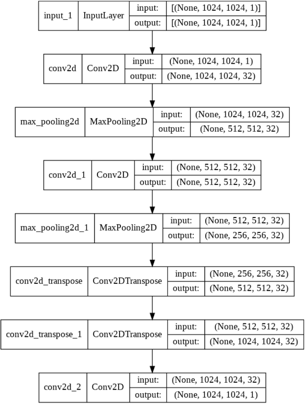

- Base is Convolutional autoencoder for image denoising from official keras docs
- Adapted loss for Structural Similarity Index (SSIM)
- Decided for that because
- Relatively straight forward to tune
- Simple architecture
- Sufficient for our image detection problem

#### Implementation and findings

Over the course of the implementation it became apparent, that
- properly pre-processed images improve the performance of the autoencoder a lot
- a deep convolutional autoencoder is sufficient to reproduce the images properly
- the autoencoder should be trained with color images as the color provides most of the information for the task
- the biggest challenge is the length of training as 
  - too short training shows too many reconstruction errors
  - too long training reconstructs anomalies 
- as well as the threshold for finding the most useful SSIM differences

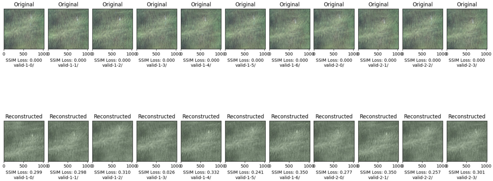
Reconstruction worked well

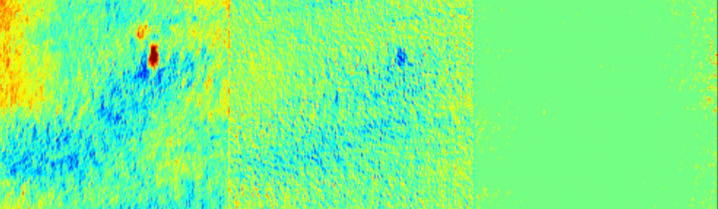

Visualization of activation layers over RBG channels, showing stronger activations for red and blue channel

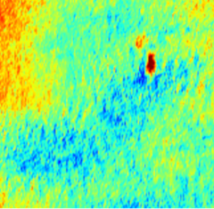

Indication of finding the anomalies as desired. 

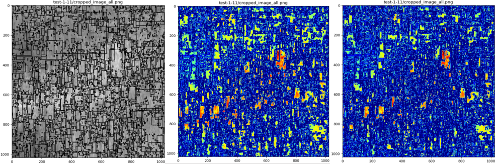

Finding the proper threshold for SSIM differences

As the project was implemented during a semester at university, in the end we implemented the whole pipeline to fit the corresponding grading criteria

---

## Getting started

1. Create the course environment:
   `conda env create --name cv_lab python=3.9 -f environment.yaml`
1. activate env:
   `conda activate cv_lab`

If you install dependencies, add the package to the environment file.

## Add data

Download data from here: https://drive.google.com/file/d/1R9DHYRgnhs0x9oMaWi-HX2zz8uvNsfxL/view
and add to the data folder.
(It is not uploaded to Github as it is too big)

## Anomaly Detection Algorithm

First implementations on Google Colab: https://colab.research.google.com/drive/1UXrw17Lsbt-hsOIerbMG4JuFzpn73DWK?usp=sharing

To make the google colab notebook work you need to upload the data on your google drive and mount your google drive

## TODOs

https://github.com/Createdd/computervision_ue/projects/2